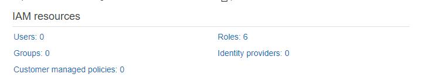
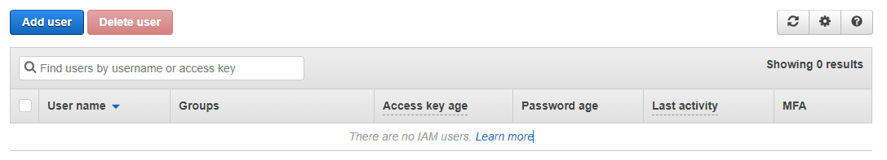
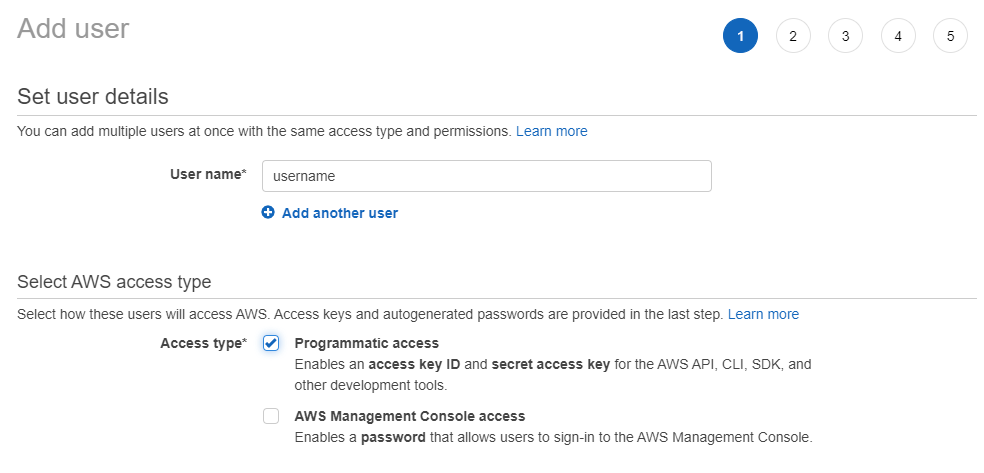
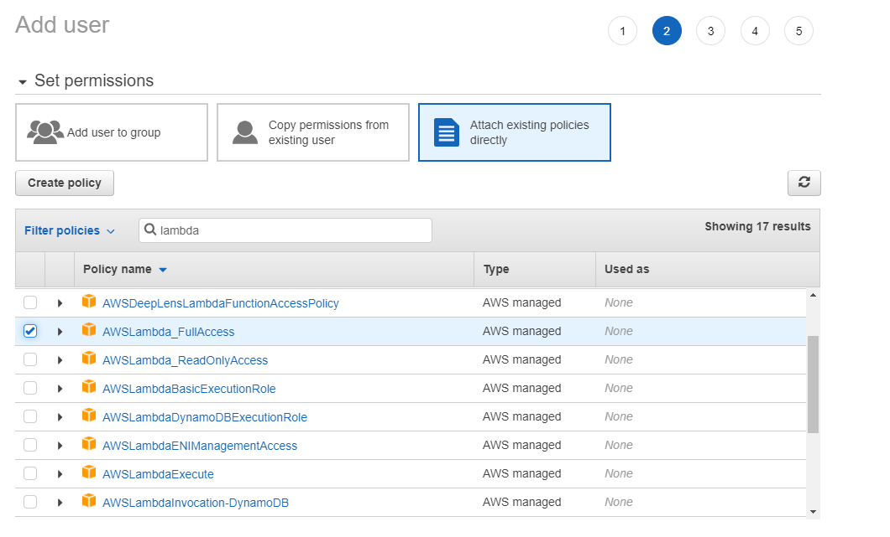
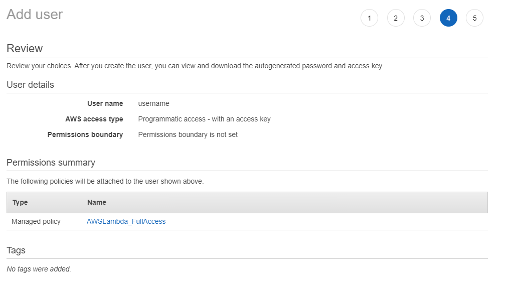
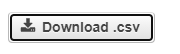

# Chalice Scraper

## Quickstart

`python -m venv chalice`

### Windows
`chalice\Scripts\activate.bat`  

### Unix
`chalice/bin/activate`  

`python -m pip install chalice`

## Credentials

Before you can deploy an application, be sure you have credentials configured. If you have previously configured your machine to run boto3 (the AWS SDK for Python) or the AWS CLI then you can skip this section.

If this is your first time configuring credentials for AWS you can follow these steps to quickly get started:

`mkdir ~/.aws`  
`cat >> ~/.aws/config`  

[default]
aws_access_key_id=YOUR_ACCESS_KEY_HERE
aws_secret_access_key=YOUR_SECRET_ACCESS_KEY
region=YOUR_REGION (such as us-west-2, us-west-1, etc)
If you want more information on all the supported methods for configuring credentials, see the boto3 docs.

### Windows

`choco install awscli`  
`refreshenv`  
`aws configure`  

Get your aws access key through these steps:  

1. Open the IAM console at https://console.aws.amazon.com/iam/  

2. Click Users  

3. Click Add user  

4. Enter a user name and chose programmatic access type  

5. Set your permission as AWSLambda_FullAccess  

6. Review that the IAM user has these following details  

7. Continue and download your access key as a .csv  

## Deploying

## Next Steps

## References

https://github.com/aws/chalice  
https://docs.aws.amazon.com/powershell/latest/userguide/pstools-appendix-sign-up.html  